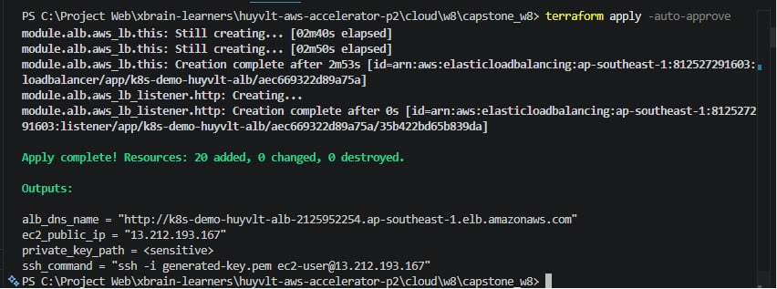

# 🚀 Kubernetes on AWS — Terraform 1-Click

Dự án này là bài Lab/Challenge của **Week 8 (Mini K8s Platform)** trong khóa học **AWS Accelerator Phase 2**. Dự án tự động hóa 100% quy trình dựng hạ tầng AWS (VPC, EC2, ALB), cài đặt cụm Kubernetes (Minikube cluster) và triển khai một ứng dụng web (HTML frontend chạy Nginx) bên trong Kubernetes bằng một lệnh duy nhất.

---

## 📐 Sơ đồ Kiến trúc Hệ thống

```text
┌─────────────────────────────────────────────────────────────────┐
│                        AWS Cloud (ap-southeast-1)               │
│                                                                 │
│  ┌──────────────────────── VPC 10.0.0.0/16 ──────────────────┐  │
│  │                                                            │  │
│  │   ┌─────────────────────────────────────────────────────┐  │  │
│  │   │         Internet Gateway                            │  │  │
│  │   └────────────────────┬────────────────────────────────┘  │  │
│  │                        │                                   │  │
│  │   ┌────────────────────▼───────────────────────────────┐   │  │
│  │   │       AWS ALB  (Internet-facing, port 80)          │   │  │
│  │   │       Security Group: allow 0.0.0.0/0:80,443       │   │  │
│  │   └────────────────────┬────────────────────────────────┘   │  │
│  │                        │ forward → Target Group            │  │
│  │                        │ EC2:NodePort 30080                │  │
│  │   ┌────────────────────▼───────────────────────────────┐   │  │
│  │   │   EC2 t3.medium  (Public Subnet 10.0.1.0/24)       │   │  │
│  │   │   Amazon Linux 2023                                 │   │  │
│  │   │                                                     │   │  │
│  │   │   ┌─────────────────────────────────────────────┐   │   │  │
│  │   │   │    Minikube Node (Docker-in-EC2)             │   │   │  │
│  │   │   │                                                     │   │  │
│  │   │   │   ┌──────────────────────────────────────┐  │   │   │  │
│  │   │   │   │  Namespace: default                   │  │   │   │  │
│  │   │   │   │                                       │  │   │   │  │
│  │   │   │   │  Service: NodePort 30080 → Pod:80     │  │   │   │  │
│  │   │   │   │                                       │  │   │   │  │
│  │   │   │   │  ┌──────────┐  ┌──────────┐           │  │   │   │  │
│  │   │   │   │  │  Pod 1   │  │  Pod 2   │  replicas │  │   │   │  │
│  │   │   │   │  │  nginx   │  │  nginx   │  = 2      │  │   │   │  │
│  │   │   │   │  └──────────┘  └──────────┘           │  │   │   │  │
│  │   │   │   └──────────────────────────────────────┘  │   │   │  │
│  │   │   └─────────────────────────────────────────────┘   │   │  │
│  │   └────────────────────────────────────────────────────┘   │  │
│  └────────────────────────────────────────────────────────────┘  │
└─────────────────────────────────────────────────────────────────┘

Luồng đi của Traffic:
Internet → ALB:80 → Target Group → EC2:30080 → Port Forward → Minikube Service (NodePort) → Pod Nginx:80
```

---

## ⚙️ Cách 3 Terraform Providers được kết nối (Wiring)

Dự án này đáp ứng vượt yêu cầu tối thiểu (≥ 2 providers) bằng việc sử dụng **3 providers** bổ trợ nhau:

| Provider | Vai trò trong hệ thống | Tài nguyên khởi tạo |
| :--- | :--- | :--- |
| **`hashicorp/aws`** | Dựng hạ tầng Cloud chính trên AWS | VPC, Subnets, SG, EC2, ALB, Target Groups |
| **`hashicorp/tls`** | Tự động sinh khóa mã hóa cryptographic SSH | `tls_private_key` |
| **`hashicorp/local`** | Xuất khóa SSH private key ra disk máy cục bộ | `local_sensitive_file` |

### Sơ đồ liên kết dữ liệu giữa các Providers (Wiring Flow):

```text
┌────────────────────────────────────────────────────────┐
│  Provider: TLS                                         │
│                                                        │
│  tls_private_key.this                                  │
│    ├── .private_key_pem ────────────────────────────► local_sensitive_file
│    │                                                   (generated-key.pem)
│    └── .public_key_openssh                            │
│              │                                         │
│              ▼                                         │
│  Provider: AWS                                         │
│                                                        │
│  aws_key_pair.this                                     │
│    public_key = tls_private_key.this.public_key_openssh│
│              │                                         │
│              ▼                                         │
│  aws_instance.this                                     │
│    key_name = aws_key_pair.this.key_name               │
└────────────────────────────────────────────────────────┘
```

* **Giải thích cơ chế**: 
  1. Thay vì bắt người dùng phải tạo SSH key thủ công trên AWS Console trước, provider `tls` sẽ tự động tạo một cặp khóa SSH bảo mật ngẫu nhiên ngay trong bộ nhớ cache lúc chạy Terraform.
  2. Public key từ `tls` được truyền trực tiếp làm input cho resource `aws_key_pair` của provider `aws`.
  3. Private key được ghi trực tiếp ra tệp `generated-key.pem` trên máy tính cục bộ thông qua provider `local` với quyền hạn bảo mật tệp là `0600`.
  4. Cuối cùng, EC2 instance được liên kết với `aws_key_pair` vừa tạo để bạn có thể SSH debug bất cứ lúc nào.

---

## ⚡ Hướng dẫn cài đặt & chạy nhanh (1-Click Deploy)

### Điều kiện tiên quyết:
- Đã cài đặt **Terraform CLI** (phiên bản `>= 1.6.0`).
- Đã cài đặt và cấu hình **AWS CLI** có đủ quyền quản trị tài nguyên (`VPC, EC2, ALB, IAM`).

### Các bước triển khai:

1. **Khởi tạo thư mục làm việc**:
   ```bash
   cd cloud/w8/capstone_w8
   ```

2. **Chuẩn bị file biến (Tùy chọn)**:
   ```bash
   cp terraform.tfvars.example terraform.tfvars
   ```

3. **✅ Chạy 1 lệnh duy nhất để Deploy**:
   ```bash
   terraform init && terraform apply -auto-approve
   ```

*(⏱ Thời gian hoàn thành: ~7-10 phút để AWS cấu hình ALB và EC2 hoàn tất script bootstrap cài đặt K8s).*

4. **Lấy URL để truy cập ứng dụng**:
   Xem output trả về ở cuối dòng terminal, hoặc chạy lệnh:
   ```bash
   terraform output alb_dns_name
   ```
   Copy URL dạng `http://k8s-demo-huyvlt-alb-XXXXXXXXX.ap-southeast-1.elb.amazonaws.com` mở trên trình duyệt. Bạn sẽ thấy một Dashboard theo dõi Kubernetes cực kỳ chuyên nghiệp và hiện đại được thiết kế riêng.

---

## 🔍 Kiểm tra Trạng thái bên trong EC2 (Debug)

Nếu muốn kết nối trực tiếp vào máy chủ EC2 để kiểm tra trạng thái cluster Kubernetes, bạn có thể thực hiện như sau:

1. **SSH vào EC2**:
   ```bash
   # Sử dụng file key tự động sinh ra
   ssh -i generated-key.pem ec2-user@$(terraform output -raw ec2_public_ip)
   ```

2. **Xem tiến trình bootstrap (cài đặt Docker/Minikube/Deploy)**:
   ```bash
   sudo tail -f /var/log/bootstrap.log
   ```

3. **Kiểm tra trạng thái Kubernetes**:
   ```bash
   # Kiểm tra các Pods đang chạy (phải có 2 replicas nginx)
   kubectl get pods
   
   # Kiểm tra Service NodePort
   kubectl get svc
   ```

---

## 🛑 Dọn dẹp Tài nguyên (Destroy)

Sau khi demo xong, hãy **chắc chắn** dọn dẹp sạch sẽ tài nguyên để tránh phát sinh chi phí AWS ngoài ý muốn:

```bash
terraform destroy -auto-approve
```
Tất cả các tài nguyên bao gồm ALB, EC2, Private Key, Subnets và VPC sẽ được xóa bỏ triệt để.

---

## 💎 Điểm cộng thiết kế & Giải thích kỹ thuật

* **Tìm kiếm AMI động (Dynamic AMI Resolution)**: Thay vì gán cứng AMI ID (dễ bị lỗi khi đổi AWS Region hoặc khi AWS cập nhật bản vá mới), dự án sử dụng `aws_ssm_parameter` để truy vấn trực tiếp AWS SSM Parameter Store để lấy ID của hệ điều hành *Amazon Linux 2023* mới nhất tương ứng với Region được cấu hình.
* **AWS ALB Health Check linh hoạt**: Load Balancer thực hiện kiểm tra tình trạng ứng dụng (Health Check) trực tiếp qua cổng `30080` của EC2. ALB sẽ tự động chuyển sang trạng thái `Active` ngay khi container K8s bên trong khởi động thành công và phản hồi mã trạng thái HTTP 200.
* **Giao diện HTML đẹp mắt**: Web ứng dụng được tùy biến giao diện tối giản, tối ưu cho nhà phát triển (Cyberpunk Dashboard), có hiệu ứng animation nhấp nháy đèn báo trạng thái `LIVE`, bảng cấu chi tiết thông tin máy chủ EC2 (ID, Private IP, thời gian Build) lấy tự động thông qua EC2 Instance Metadata Service.

---

## 📸 Hình ảnh minh chứng (Evidence)

### 1. Kết quả chạy `terraform apply` thành công:


### 2. Giao diện Cyberpunk Dashboard hiển thị thông tin Minikube:

