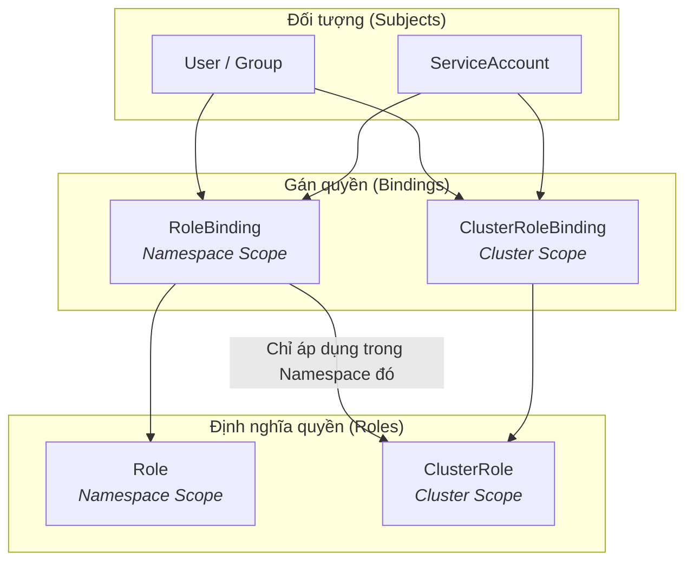
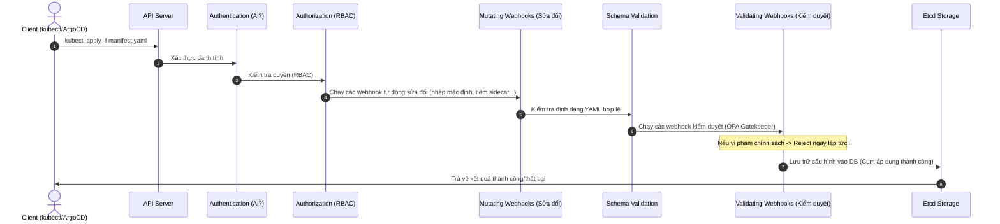

# HƯỚNG DẪN HỌC TẬP & THỰC HÀNH · WEEK 10
## Chủ đề: Secure & Operate (RBAC + Admission Policy)

Chào mừng bạn đến với Week 10! Tài liệu này tóm tắt toàn bộ phần **Lý thuyết cần nắm vững (Cần học gì)** và **Các bước thực hành chi tiết (Cần làm gì)** để hoàn thành mục tiêu thiết lập hạ tầng bảo mật cấp cụm (Cluster-level Enforcement) sử dụng RBAC và OPA Gatekeeper.

---

## 🗺️ PHẦN 1: BẢN ĐỒ KIẾN THỨC (Cần học gì để hiểu?)

### 1.1. Tại sao cần Cluster-level Enforcement?
Trong các tuần trước, chúng ta đã xây dựng cụm Kubernetes (W8), GitOps & Observability & Canary (W9). Tuy nhiên, cụm K8s lúc này giống như "cái chợ" - không có rào cản ngăn chặn sự cố.
* **Vấn đề**: Developer có thể vô tình xóa namespace `prod`, kéo image chứa CVE nguy hiểm, quên set limits RAM/CPU dẫn đến sập Node (eviction), hoặc chạy ứng dụng dưới quyền root.
* **Giải pháp**: Phải thực thi chính sách chặn vi phạm **TẠI CỤM** (ngay từ API Server), không phụ thuộc vào lời hứa của lập trình viên.
* **2 lớp kiểm soát chính**:
  1. **RBAC**: Trả lời câu hỏi **"Ai (Who) được phép thực hiện hành động gì (What)?"**
  2. **Admission Policy**: Trả lời câu hỏi **"Tài nguyên được tạo ra có cấu hình thế nào (How)?"**

---

### 1.2. Lớp 1: RBAC (Role-Based Access Control)
RBAC kiểm soát quyền truy cập tài nguyên của cụm dựa trên vai trò. Nó bao gồm 4 khái niệm cốt lõi chia thành 2 cặp:

#### 🔹 Định nghĩa quyền (Quyền làm gì?)
* **Role**: Định nghĩa quyền trong phạm vi **1 Namespace** cụ thể (ví dụ: chỉ được thao tác trong namespace `demo`).
* **ClusterRole**: Định nghĩa quyền trên **Toàn cụm** (Cluster-wide), áp dụng cho mọi namespace và các tài nguyên không thuộc namespace nào (như Nodes, Namespaces, PersistentVolumes).

#### 🔹 Gán quyền (Gán cho ai?)
* **RoleBinding**: Gán một `Role` hoặc `ClusterRole` cho đối tượng cụ thể (User/Group/ServiceAccount) trong phạm vi **1 Namespace**.
* **ClusterRoleBinding**: Gán một `ClusterRole` trên phạm vi **Toàn cụm**.

| Khái niệm | Phạm vi (Scope) | Tài nguyên áp dụng | Thường dùng cho |
| :--- | :--- | :--- | :--- |
| **Role** | Namespace | Pods, Deployments, Services, v.v. | Developer làm việc trong Namespace riêng |
| **ClusterRole** | Cluster | Nodes, Namespaces, Pods (toàn cụm) | SRE, Auditor, Cluster Admin |
| **RoleBinding** | Namespace | Gán quyền trong 1 Namespace cụ thể | Gán quyền SRE/Viewer chỉ cho Namespace test |
| **ClusterRoleBinding** | Cluster | Gán quyền trên toàn bộ các Namespace | Gán quyền SRE toàn cụm cho Bob, Viewer cho Carol |

#### 📊 Sơ đồ mối quan hệ RBAC


#### 🤖 ServiceAccount (SA) là gì?
* **Khái niệm**: Pod cũng cần gọi Kubernetes API (ví dụ: Prometheus pod cần lấy danh sách pods để crawl metrics). Để làm vậy, Pod cần một danh tính (Identity).
* **ServiceAccount** chính là danh tính dành cho ứng dụng/Pod chạy trong cụm. Bạn tạo SA, gán quyền cho SA thông qua RoleBinding/ClusterRoleBinding, sau đó gán SA đó vào `spec.serviceAccountName` của Pod.

#### 🛠️ Lệnh debug quyền nhanh: `kubectl auth can-i`
Trước khi triển khai hoặc khi cần debug lỗi 403 Forbidden, hãy sử dụng tính năng **Giả lập quyền (Impersonation)**:
```bash
# Kiểm tra quyền của chính bạn
kubectl auth can-i create pods -n demo

# Kiểm tra quyền của một User khác (Cần quyền admin để chạy lệnh này)
kubectl auth can-i delete deployments -n prod --as alice

# Kiểm tra quyền của một ServiceAccount cụ thể
kubectl auth can-i list pods -n prod --as system:serviceaccount:prod:app-sa
```

---

### 1.3. Lớp 2: Admission Policy (OPA Gatekeeper)
RBAC chỉ kiểm tra xem *"Alice có quyền tạo Deployment không"*. Nhưng nếu Alice tạo Deployment chứa **image tag `:latest`** hoặc **không khai báo limits**, RBAC vẫn sẽ cho qua. Chúng ta cần Admission Controller để kiểm duyệt cấu trúc Manifest.

#### 🔄 Quy trình xử lý Request của Kubernetes API Server


#### 🚪 OPA Gatekeeper & Policy-as-Code
OPA (Open Policy Agent) Gatekeeper là một công cụ giúp thực thi chính sách dưới dạng mã (Policy-as-Code) trong Kubernetes bằng ngôn ngữ viết luật **Rego**.

Gatekeeper hoạt động dựa trên 2 thành phần chính:
1. **ConstraintTemplate**:
   * Định nghĩa khung/mẫu của chính sách bằng ngôn ngữ **Rego**.
   * Chỉ định các tham số đầu vào (ví dụ: danh sách labels bắt buộc).
   * Khi deploy, nó tự động sinh ra một Custom Resource Definition (CRD) mới trong cụm.
2. **Constraint**:
   * Là một bản thể (Instance) cụ thể sử dụng CRD được sinh ra từ ConstraintTemplate.
   * Truyền tham số cụ thể vào (ví dụ: bắt buộc label `owner`).
   * Xác định mục tiêu áp dụng (`match` theo namespace, kinds) và hành vi xử lý (`enforcementAction`).

#### ⚠️ Chế độ Warn (Audit) vs Deny (Enforce)
* **`enforcementAction: dryrun` hoặc `warn`**: Ghi nhận tài nguyên vi phạm vào log/status hoặc cảnh báo ra console, **KHÔNG** chặn deploy. Thích hợp để test chính sách mới hoặc kiểm tra các ứng dụng cũ đang chạy có vi phạm không.
* **`enforcementAction: deny`**: Từ chối ngay lập tức các manifest vi phạm. Áp dụng khi chính sách đã ổn định.

---

## 🛠️ PHẦN 2: LỘ TRÌNH THỰC HÀNH (Cần làm gì?)

Bạn cần hoàn thành các bài Lab dưới đây và triển khai mọi thứ thông qua mô hình **GitOps (ArgoCD)**, tuyệt đối không dùng lệnh `kubectl apply` tay trên production.

```
Thư mục dự án khuyến nghị:
└── cloud/w10/
    ├── rbac/
    │   ├── roles.yaml             # Chứa các Role và ClusterRole
    │   └── rolebindings.yaml      # Gán quyền cho alice, bob, carol
    └── gatekeeper/
        └── constraints/           # Chứa 4 Constraints + 1 Custom Policy
```

### 📍 Bước chuẩn bị
1. **Fork repository** chứa mã nguồn Platform của bạn.
2. Sửa file ứng dụng gốc của ArgoCD (`cloud/w10/argocd/root.yaml`) để trỏ `repoURL` về repository bạn vừa fork.
3. Xác nhận toàn bộ Platform từ W9 được đồng bộ xanh (`Synced`/`Healthy`).

---

### 👤 Lab 1.1: Cấu hình RBAC qua GitOps
Tạo và cấu hình phân quyền cho 3 User giả lập với các đặc quyền sau:

| Đối tượng (User) | Vai trò (Role) | Phạm vi | Quyền hạn được phép |
| :--- | :--- | :--- | :--- |
| **alice** | `developer` | Namespace `demo` | CRUD (Create, Read, Update, Delete) trên workloads: Pods, Deployments, Services, ReplicaSets, StatefulSets. |
| **bob** | `sre` | Toàn cụm (Cluster) | Thao tác (CRUD) trên các resource liên quan đến Pods (logs, exec, delete) ở mọi namespace để debug nhanh. |
| **carol** | `viewer` | Toàn cụm (Cluster) | Chỉ đọc (Read-only / get, list, watch) toàn bộ tài nguyên trong cụm. Không được phép tạo, sửa, xóa bất kỳ thứ gì. |

#### 💡 Gợi ý thiết kế:
* **alice**: Tạo một `Role` trong namespace `demo` định nghĩa đầy đủ verbs (`*` hoặc cụ thể) cho các resources cần thiết. Liên kết bằng `RoleBinding` trong namespace `demo` cho `User` alice.
* **bob**: Tạo một `ClusterRole` chứa quyền với resource `pods` và subresources như `pods/log`, `pods/exec`. Liên kết bằng `ClusterRoleBinding` cho `User` bob.
* **carol**: Tạo một `ClusterRole` chỉ chứa các verbs `get`, `list`, `watch` cho tất cả các tài nguyên cơ bản. Liên kết bằng `ClusterRoleBinding` cho `User` carol.
* Đừng quên tạo file ArgoCD Application `cloud/w10/argocd/apps/rbac.yaml` để quản lý thư mục `cloud/w10/rbac/`.

---

### 🛡️ Lab 1.2: Triển khai OPA Gatekeeper & 4 Constraints chống lỗi
Cài đặt Gatekeeper controller và thiết lập 4 luật chặn tự động:

| STT | Tên chính sách | Mô tả kiểm tra | Rủi ro ngăn chặn |
| :---: | :--- | :--- | :--- |
| **1** | **Cấm image `:latest`** | Chặn mọi Container sử dụng image tag `:latest` hoặc không có tag (mặc định là latest). | **F-01**: Khó kiểm soát version, lỗi trôi nổi code trên production. |
| **2** | **Bắt buộc có RAM/CPU limits** | Chặn các Pod không cấu hình `resources.limits.cpu` và `resources.limits.memory`. | **F-02**: Pod ăn hết tài nguyên của Node, gây evict hàng loạt Pod khác. |
| **3** | **Cấm chạy dưới quyền Root** | Chặn các cấu hình có `runAsUser: 0` hoặc cho phép chạy root privilege. | **F-04**: Lỗ hổng bảo mật leo thang đặc quyền (Container breakout). |
| **4** | **Cấm sử dụng Host Network** | Chặn các Pod cấu hình `hostNetwork: true`. | **Bảo mật**: Pod có thể nghe lén traffic của host hoặc bypass network policy. |

#### 💡 Gợi ý triển khai:
1. Đăng ký cài đặt Gatekeeper controller thông qua ArgoCD Application (`cloud/w10/argocd/apps/gatekeeper.yaml`). Nên đặt `sync-wave` sớm để Controller lên trước.
2. Tìm kiếm các `ConstraintTemplate` sẵn có từ thư viện chuẩn [Gatekeeper Library](https://github.com/open-policy-agent/gatekeeper-library) (ví dụ: `k8sallowedrepos`, `k8srequiredresources`, `k8spspallowprivilegeescalation`...). **Bạn không cần tự viết mã Rego cho 4 chính sách này.**
3. Tạo các file `Constraint` tương ứng.
4. **BẪY CẦN TRÁNH**: Hãy kiểm tra xem các ứng dụng hiện tại trên platform (Prometheus, ArgoCD, Ingress Controller...) có đang vi phạm các quy tắc trên không.
   * *Mẹo*: Hãy bật `enforcementAction: warn` trước. Check log hoặc xem trạng thái Constraint để biết các resource vi phạm. Sau khi sửa hết các cấu hình vi phạm trên cụm, mới đổi sang `enforcementAction: deny`.

---

### 🎨 Lab 1.3: Tự viết 1 Custom Policy (Rego)
Viết một chính sách của riêng bạn để làm quen với ngôn ngữ Rego. Chọn **1 trong 3** đề bài sau:

1. **Chặn Deployment có `replicas > 5`**: Ngăn chặn lỗi scale vô tội vạ làm cạn kiệt tài nguyên node hoặc làm tăng chi phí AWS (nếu có Cluster Autoscaler).
2. **Bắt buộc mọi workload phải cấu hình label `owner`**: Giúp định danh đội nhóm sở hữu tài nguyên để dễ dàng quy trách nhiệm hoặc tính toán chi phí (FinOps).
3. **Chỉ cho phép Image từ Registry an toàn (Whitelist)**: Chỉ cho phép pull image từ các registry uy tín (ví dụ: `ghcr.io/your-username/*`, `*.dkr.ecr.ap-southeast-1.amazonaws.com`), chặn đứng việc dùng image trôi nổi trên internet.

#### 💡 Ví dụ cấu trúc file Custom Policy (Ví dụ: Yêu cầu label `owner`):
* **ConstraintTemplate (`gatekeeper/constraints/template-required-labels.yaml`)**:
  ```yaml
  apiVersion: templates.gatekeeper.sh/v1
  kind: ConstraintTemplate
  metadata:
    name: k8srequiredlabels
  spec:
    crd:
      spec:
        names:
          kind: K8sRequiredLabels
        validation:
          openAPIV3Schema:
            properties:
              labels:
                type: array
                items:
                  type: string
    targets:
      - target: admission.k8s.gatekeeper.sh
        rego: |
          package k8srequiredlabels
          violation[{"msg": msg}] {
            provided := {l | input.review.object.metadata.labels[l]}
            required := {l | l := input.parameters.labels[_]}
            missing := required - provided
            count(missing) > 0
            msg := sprintf("Thất bại! Manifest thiếu các labels bắt buộc: %v", [missing])
          }
  ```
* **Constraint (`gatekeeper/constraints/constraint-owner-label.yaml`)**:
  ```yaml
  apiVersion: constraints.gatekeeper.sh/v1beta1
  kind: K8sRequiredLabels
  metadata:
    name: deployment-must-have-owner
  spec:
    enforcementAction: deny
    match:
      kinds:
        - apiGroups: ["apps"]
          kinds: ["Deployment"]
    parameters:
      labels: ["owner"]
  ```

---

## 🧪 PHẦN 3: HƯỚNG DẪN NGHIỆM THU (Verification)

Sau khi hoàn thành commit code lên GitHub và ArgoCD báo trạng thái xanh (`Synced`), bạn cần tự chạy các lệnh kiểm tra sau để nghiệm thu:

### 3.1. Nghiệm thu RBAC
Chạy 4 lệnh test giả lập sau trên Terminal:
```bash
# 1. Kiểm tra alice có quyền CRUD workload trong namespace demo không?
# Kỳ vọng: yes
kubectl auth can-i create deployment -n demo --as alice

# 2. Kiểm tra alice có quyền ghi phá ở namespace hệ thống không?
# Kỳ vọng: no
kubectl auth can-i create deployment -n kube-system --as alice

# 3. Kiểm tra bob (SRE) có xem được pods toàn cụm để cứu hộ không?
# Kỳ vọng: yes
kubectl auth can-i get pods -A --as bob

# 4. Kiểm tra carol (viewer) có quyền xóa node hay hạ tầng không?
# Kỳ vọng: no
kubectl auth can-i delete nodes --as carol
```

### 3.2. Nghiệm thu OPA Gatekeeper & Custom Policy
Thử tạo các Pod/Deployment vi phạm trực tiếp hoặc dùng lệnh `kubectl apply --dry-run=server` để test:
* **Test Image `:latest`**: Deploy pod có image `nginx:latest` -> Phải bị từ chối kèm lỗi chỉ rõ vi phạm.
* **Test Resources Limits**: Deploy pod không khai báo RAM/CPU limits -> Phải bị từ chối.
* **Test Privilege Escalation**: Deploy pod có `runAsUser: 0` -> Phải bị từ chối.
* **Test Host Network**: Deploy pod có `hostNetwork: true` -> Phải bị từ chối.
* **Test Custom Policy**: Deploy pod không có label `owner` (hoặc replicas > 5 tuỳ theo lựa chọn của bạn) -> Phải bị từ chối.
* **Test Pod hợp lệ**: Một manifest chuẩn chỉnh (đủ limits, pin version image `nginx:1.25.1`, non-root, có label `owner`) -> Phải đi qua Validation và deploy thành công (`pass`).

---

## 📝 PHẦN 4: CHECKLIST HOÀN THÀNH (Deliverables)

Hãy chắc chắn rằng bạn đã hoàn thành và đẩy các thành phần sau lên nhánh chính của repository fork:
- [ ] Thư mục `cloud/w10/rbac/` chứa đầy đủ cấu hình Roles, ClusterRoles, RoleBindings, ClusterRoleBindings.
- [ ] Thư mục `cloud/w10/gatekeeper/constraints/` chứa đầy đủ các file Constraints và ConstraintTemplates (bao gồm cả luật Custom).
- [ ] Thư mục `cloud/w10/argocd/apps/` chứa các file đăng ký Application để ArgoCD tự động quản lý vòng đời của RBAC và Gatekeeper.
- [ ] Đảm bảo Platform chung vẫn hoạt động bình thường, các ứng dụng Prometheus, Grafana, Ingress Controller, Argo Rollouts không bị chính sách Gatekeeper chặn đứng.

*Chúc các bạn hoàn thành tốt buổi Lab để chuẩn bị sẵn sàng cho Capstone Project (W11-W12)!*
