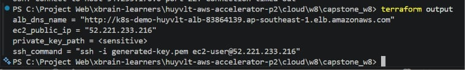

# Báo Cáo Bằng Chứng Minh Chứng — Capstone W8 (K8s on AWS)

- **Sinh viên:** Võ Lê Trường Huy
- **MSSV:** XB-DN26-102
- **Lớp / Nhóm:** Group 3 — DevOps
- **Bài Lab:** Week 8 — Mini K8s Platform (1-Click Automation)

---

## 📐 Tổng Quan Kiến Trúc Dự Án

Dự án tự động hóa 100% bằng Terraform để dựng hạ tầng mạng ảo và máy chủ trên AWS, cài đặt và cấu hình cụm Kubernetes Minikube trên máy chủ EC2, chạy ứng dụng Nginx phục vụ trang Cyberpunk Dashboard, sau đó expose ứng dụng an toàn ra ngoài Internet thông qua bộ cân bằng tải ALB (Application Load Balancer).

**Đặc điểm kiến trúc:**
- **Terraform** tạo VPC biệt lập, 2 Public Subnets ở 2 AZs khác nhau (yêu cầu bắt buộc của ALB), Internet Gateway, Route Tables, Security Groups, EC2 và ALB.
- **EC2 Instance** tự động cài đặt Docker, Minikube và deploy app bằng script UserData (`bootstrap.sh`) khi khởi động lần đầu.
- **Ứng dụng chạy trong K8s:** Trang Cyberpunk Dashboard được đóng gói trong ConfigMap và mount vào 2 Pod Nginx, hoàn toàn không cài đặt trực tiếp lên EC2 host.
- **Luồng mạng (Traffic Flow):** Internet ──► ALB (cổng 80) ──► EC2 NodePort (cổng 30080) ──► Port-Forward ──► Minikube Service (cổng 80) ──► Nginx Pods.
- **Tích hợp 3 Providers:** `aws` (hạ tầng), `tls` (sinh SSH Key tự động) và `local` (ghi file key ra đĩa local).

---

## 1. Ứng Dụng Truy Cập Được Qua ALB (`alb.jpg`)

Bằng chứng xác nhận URL của ALB hoạt động ổn định trên trình duyệt và trả về giao diện Dashboard hiển thị thông tin học viên.

- **ALB DNS URL:** `http://k8s-demo-huyvlt-alb-362721449.ap-southeast-1.elb.amazonaws.com`
- **Ảnh minh chứng:** Chụp màn hình trình duyệt hiển thị rõ thanh địa chỉ chứa URL của ALB và giao diện Cyberpunk Dashboard.


---

## 2. Terraform Apply & Outputs (`apply.jpg` & `output.jpg`)

Bằng chứng xác nhận hạ tầng được dựng thành công tự động (1-Click) và xuất ra các thông tin outputs phục vụ vận hành.

- **Lệnh thực hiện:** `terraform apply -auto-approve`
- **Ảnh 2.1 - Apply thành công:**

- **Ảnh 2.2 - Terraform Outputs:**


---

## 3. Minikube Chạy Trên EC2 (`k8s_proof.jpg`)

Bằng chứng xác nhận cụm Kubernetes hoạt động khỏe mạnh bằng Minikube với Driver Docker bên trong EC2 instance (không cài ứng dụng trực tiếp lên hệ điều hành EC2).

- **Lệnh chạy trên EC2:** `minikube status`
- **Ảnh minh chứng (nằm trong file `k8s_proof.jpg`):**
  Hiển thị trạng thái các tiến phần của Minikube:
  - `host: Running`
  - `kubelet: Running`
  - `apiserver: Running`
  - `kubeconfig: Configured`

---

## 4. Ứng Dụng Chạy Trong Kubernetes (`k8s_proof.jpg`)

Bằng chứng xác nhận ứng dụng web Nginx được quản lý bằng các tài nguyên Kubernetes chuẩn (Deployment, Service NodePort).

- **Lệnh chạy trên EC2:**
  ```bash
  kubectl get nodes -o wide
  kubectl get pods
  kubectl get svc
  ```
- **Ảnh minh chứng (nằm trong file `k8s_proof.jpg`):**
  - Node `minikube` có status là `Ready`.
  - 2 Pods `demo-app-...` có status là `Running` và `READY 1/1`.
  - Service `demo-app-svc` hoạt động với type là `NodePort`, map cổng `80:30080`.

---

## 5. Kiểm Tra Port-Forward Trên EC2 Host (`k8s_proof.jpg`)

Bằng chứng xác nhận tiến trình Port-Forwarding chạy ngầm trên EC2 lắng nghe cổng `30080` của host và đẩy dữ liệu vào Service của Minikube thành công.

- **Lệnh chạy trên EC2:**
  ```bash
  ps -ef | grep port-forward
  ```
- **Ảnh minh chứng (nằm trong file `k8s_proof.jpg`):**
  - Hiển thị tiến trình `kubectl port-forward --address 0.0.0.0 service/demo-app-svc 30080:80` đang chạy ngầm ở background.

---

## 6. Target Group Của ALB Healthy

Mô tả cơ chế Load Balancer kiểm tra tình trạng hoạt động (Health Check) của máy chủ ảo EC2 trên cổng `30080`.

- **Cơ chế hoạt động:**
  - ALB thực hiện gửi các HTTP GET request định kỳ (mỗi 30 giây) vào cổng **`30080`** tại đường dẫn gốc **`/`** của EC2.
  - Khi port-forwarding trên EC2 host nhận traffic từ ALB, nó chuyển tiếp dữ liệu vào K8s Service `demo-app-svc` và trả về mã phản hồi `200 OK` từ Nginx.
  - ALB ghi nhận phản hồi nằm trong khoảng `200-399` và đánh giá target là **`healthy`**, cho phép mở luồng traffic công cộng từ Internet.

---

## 7. Terraform Sử Dụng 3 Providers (Giải thích thiết kế)

Bằng chứng xác nhận mã nguồn của dự án sử dụng phối hợp **3 Providers** khác nhau để đáp ứng tiêu chí nghiệm thu nâng cao.

- **Lệnh kiểm tra:** `terraform providers`
- **Chi tiết các Providers sử dụng:**
  1. **`hashicorp/aws`**: Dựng hạ tầng Cloud (VPC, Security Groups, EC2, ALB).
  2. **`hashicorp/tls`**: Sinh khóa bảo mật RSA SSH Key tự động hoàn toàn trong RAM.
  3. **`hashicorp/local`**: Ghi Private Key ra ổ đĩa local làm tệp `generated-key.pem` để người dùng sử dụng SSH.

- **Luồng liên kết dữ liệu giữa các Providers (Wiring):**
  ```text
  tls_private_key (TLS Provider)
    ├── .public_key_openssh ──► aws_key_pair (AWS Provider) ──► aws_instance.key_name
    └── .private_key_pem    ──► local_sensitive_file (Local Provider) ──► generated-key.pem
  ```

---

## 8. EC2 Bootstrap Bằng User Data

Bằng chứng chứng minh máy ảo EC2 được tự động hóa cấu hình từ khi boot thông qua kịch bản `bootstrap.sh`.

- **Lệnh chạy trên EC2:** `cat /var/log/bootstrap.log`
- **Các bước chạy tự động ghi nhận trong log:**
  - Thiết lập Swap Space (4GB) để tối ưu hóa RAM.
  - Cài đặt Docker Engine và phân quyền cho `ec2-user`.
  - Tải xuống và cài đặt `minikube` + `kubectl`.
  - Khởi động Minikube bằng docker driver (`minikube start --driver=docker`).
  - Cấu hình file YAML tài nguyên K8s (ConfigMap, Deployment 2 Replicas, Service NodePort).
  - Khởi tạo tiến trình `kubectl port-forward` chạy ngầm.

---

## 9. Terraform Destroy Thành Công (`destroy.jpg`)

Bằng chứng chứng minh hạ tầng có thể dọn dẹp sạch sẽ chỉ bằng một lệnh duy nhất sau khi kết thúc buổi Show-and-Tell.

- **Lệnh thực hiện:** `terraform destroy -auto-approve`
- **Ảnh minh chứng:**

