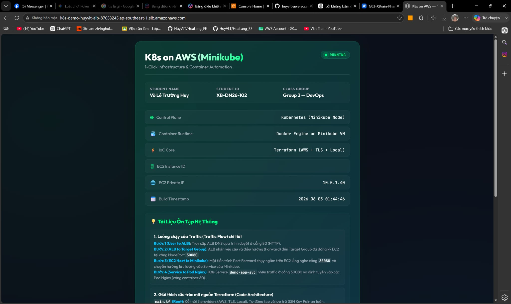
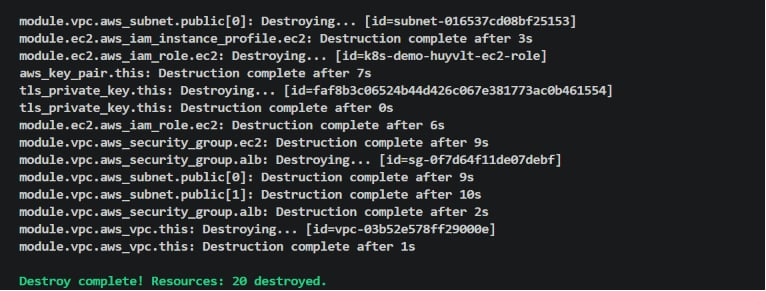

# Evidence Pack — Kubernetes on AWS (Minikube)

- **Student Name:** Võ Lê Trường Huy
- **Student ID:** XB-DN26-102
- **Class Group:** Group 3 — DevOps
- **Course Assignment:** Week 8 — Mini K8s Platform (1-Click Automation)

Tài liệu này chứa toàn bộ bằng chứng chứng minh việc hoàn thành các tiêu chí nghiệm thu (Acceptance Criteria) của bài Lab.

---

## 📸 1. Minh chứng Chạy 1-Click thành công
*Lệnh thực hiện tại thư mục `cloud/w8/capstone_w8/`:*
```bash
terraform apply -auto-approve
```
*Màn hình hiển thị kết quả tạo thành công 20 tài nguyên và in ra các outputs:*


---

## 📸 2. Minh chứng Truy cập ALB từ Internet (`alb.jpg`)
*Trình duyệt web kết nối thành công qua địa chỉ DNS Load Balancer do AWS cấp:*


---

## 📸 3. Minh chứng App thực sự chạy trong Kubernetes (`k8s_proof.jpg`)
*Kết nối SSH vào EC2 và chạy lệnh kiểm tra tài nguyên bên trong cụm Minikube:*
```bash
minikube status
kubectl get nodes -o wide
kubectl get pods
kubectl get svc
```
*Kết quả hiển thị các Pods trạng thái Running và Service NodePort hoạt động:*


---

## 📸 4. Minh chứng Dọn dẹp hạ tầng thành công (`destroy.jpg`)
*Lệnh thực hiện sau khi hoàn thành buổi Show-and-Tell để xóa sạch tài nguyên:*
```bash
terraform destroy -auto-approve
```
*Màn hình hiển thị kết quả hủy toàn bộ tài nguyên để tránh phát sinh chi phí:*

